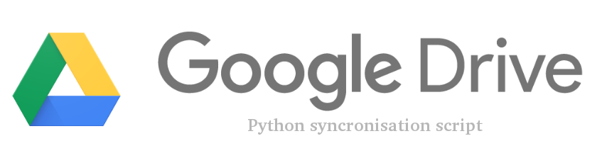

# Google-Drive-sync
A Python script to automatically synchronize your Google Drive content with local storage files.

# What it can do (for now)
- Upload folder and all it's content from local storage to Google Drive
-  Check and synchronize changes on local storage with (same) Google Drive folder
-  Check and synchronize changes on Drive with its local storage instance

So, it's two-way synchronization of selected folders, which you can run at any time (in any 'direction') you want (isn't this a dream, yeah?).

# Initial setup 

1) Turn on Google Drive API [here] (if you have any troubles, check [Python Quickstart guide]).
1) Get your .json client secret config file in [Google API Projects page] and put it in working directory (don't forget to save it as *client-secret.json*)
1) In *upload_to_drive.py* and *download_from_drive.py* file scripts change global variables FULL_PATH and DIR_NAME to your's full folder path and folder's name, which you want to upload/download/synchronize, respectively.
1) First time you run *upload_to_drive.py* or *download_from_drive.py*, it will open browser/new tab, and you will need to authenticate the script (or if it doesn't redirect you, copy the link and do authentification manually).
1) Run *drive_sync.py* script, if you want to apply changes made on local storage to specific Google Drive folder, and run *download_from_drive.py* if you want to apply changes from that Google Drive folder to your local storage.
1) (Optional) put script that you need to cron or any other task planner that you use.
1) Enjoy how simple it is!

## Requirements and Dependencies

To run this amazing project, you will need:

- Python 3 or higher installed
- Google API Python library. To install it simply run
```
   sudo pip install --upgrade google-api-python-client
```
(or see this [installation page] for more information)

- Google Account
- Internet connection

All of these items are extremely important because if you won't have at least one of then, nothing will work :('

# TO-DO and known problems/issues/features:
- Only full path to folder allowed now (you can't put your script near folder and use it's relative path).
- It's only one direction per time. So if you have changes on both local storage and Google Drive, you may lose part of your data. Be careful with that!
- Sync scripts have troubles with handling extension-less non-googledocs files. Be careful here.
- Epic things with Google Docs files. Initially, I didn't wanna even worry about that, because personally don't use them in my syncroised forlders. So finally I came up with this "duct tape" solution - when you download/update stuff from Drive to local storage, and it's 'google docs' file on Drive, it will add .extension to it's name (if need) so files will be the same on next run (for example .docx for Word files). Pay attention at this detail, if it's really important for you, it can be fixed relatively easy (for example by adding some external dictionary near scripts that will remember about correlations between Drive doc and its local storage exported copy, or something like that). Maybe someday this will be fixed.
- There is no error/exception handling for now.

## Support

If you have any questions how to use this stuff, offerings or simply want to contact me, please write me anytime on Telegram [@I_love_cats1] or email <danilatsvet@gmail.com>.


[installation page]: https://developers.google.com/api-client-library/python/start/installation
[@I_love_cats1]: https://web.telegram.org/#/im?p=@I_love_cats1
[here]: https://console.developers.google.com/flows/enableapi?apiid=drive
[Python Quickstart guide]: https://developers.google.com/drive/v3/web/quickstart/python
[Google API Prijects page]: https://console.developers.google.com/iam-admin/projects
